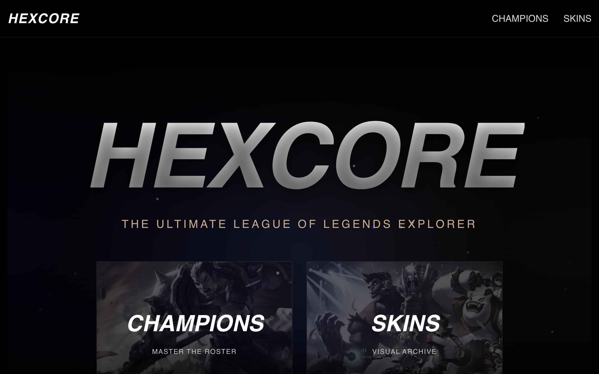

<artifact identifier="hexcore-readme" type="text/markdown" title="HEXCORE README.md">
<p align="center">
    
</p>

# HEXCORE

The Ultimate League of Legends Explorer - A modern web application for discovering champions, abilities, and skins from the world of Runeterra.

---

## ✨ Features

### 🏆 Champion Browser

- Browse all 170+ League of Legends champions
- Advanced filtering by role (Fighter, Tank, Mage, Assassin, Marksman, Support)
- Real-time search functionality
- Infinite scroll with lazy loading
- Animated champion cards with hover effects

### ⚔️ Champion Details

- Comprehensive champion information and lore
- Interactive ability showcase with video demonstrations
- Dynamic stats visualization (Attack, Defense, Magic, Difficulty)
- Full skin gallery with high-resolution splash arts
- Related champion recommendations
- Parallax scrolling hero section

### 🎨 Skins Gallery

- Complete visual archive of all champion skins
- Over 1,000+ skin previews
- Advanced search across champions and skin names
- Full-screen preview mode with scanline effects
- Direct navigation to champion pages from skin previews

### 🎭 User Experience

- Smooth page transitions and animations
- Reveal-on-scroll effects
- Persistent search and filter preferences
- Responsive design for all devices
- Premium UI with custom typography (Compacta Pro, Parabolica)
- Dynamic particle effects on landing page

## 🛠️ Prerequisites

- [Node.js](https://nodejs.org/) v20.19+ or v22.12+ recommended
- npm or yarn package manager

## 🚀 Installation & Running

1. Clone the repository:
```bash
    git clone https://github.com/fortyup/hexcore.git
    cd hexcore
```

2. Install dependencies:
```bash
    npm install
```

3. Run the development server:
```bash
    npm run dev
```

4. Open http://localhost:5173 in your browser.

## 📂 Project Structure
```
hexcore/
├── public/
│   └── vite.svg                # Favicon
├── src/
│   ├── assets/
│   │   ├── role-icons/         # Champion role icons
│   │   └── vue.svg
│   ├── components/
│   │   ├── AbilityShowcase.vue # Ability viewer with videos
│   │   ├── AppFooter.vue       # Footer with social links
│   │   ├── AppHeader.vue       # Navigation header
│   │   ├── ChampionCard.vue    # Champion grid card
│   │   ├── RoleIcon.vue        # Role icon component
│   │   ├── SkinCard.vue        # Skin grid card
│   │   ├── SkinGallery.vue     # Horizontal skin scroller
│   │   └── SkinPreview.vue     # Full-screen skin viewer
│   ├── composables/            # Vue composables
│   ├── router/
│   │   └── index.js            # Vue Router configuration
│   ├── services/
│   │   └── riotApi.js          # Riot API service layer
│   ├── utils/
│   │   └── animations.js       # Animation utilities
│   ├── views/
│   │   ├── ChampionDetailView.vue
│   │   ├── ChampionsView.vue
│   │   ├── HomeView.vue
│   │   └── SkinsView.vue
│   ├── App.vue                 # Root component
│   ├── main.js                 # Application entry point
│   └── style.css               # Global styles
├── index.html                  # HTML entry point
├── package.json                # Dependencies
├── vite.config.js              # Vite configuration
└── README.md
```

## ⚠️ Disclaimer
HEXCORE is not affiliated with Riot Games. League of Legends and all associated properties are trademarks or registered trademarks of Riot Games, Inc.

## 📄 References
- Vue website: [Vue.js](https://vuejs.org/)
- Vite website: [Vite](https://vite.dev/)
- Riot Games API: [Data Dragon](https://developer.riotgames.com/)


## 🤝 Contributing
Contributions are welcome! Please open issues or submit pull requests.
